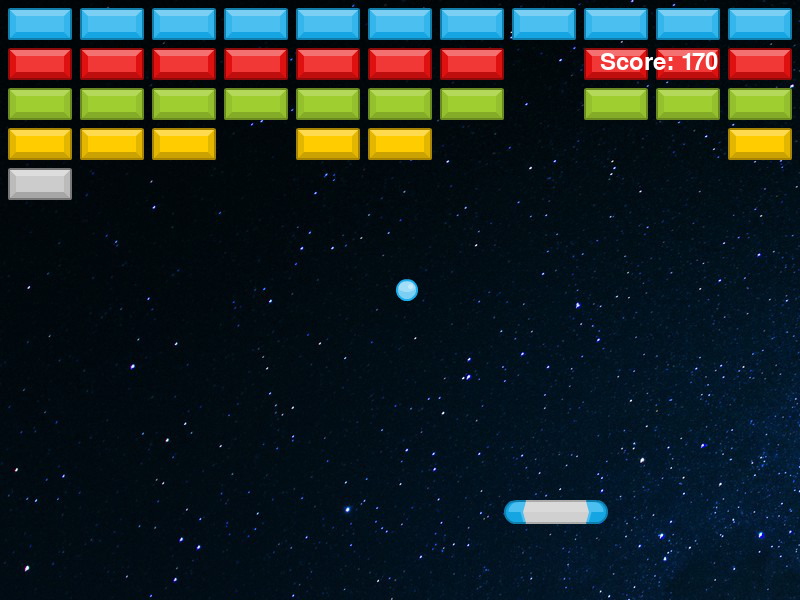

# Arkanoid Game
An implementation of the classic arcade game Arkanoid in Python using Pygame, with a NEAT AI player.





## Features
* Player-controlled paddle with keyboard input.
* Ball and brick physics.
* Sound effects.
* AI player using NeuroEvolution of Augmenting Topologies (NEAT).

## Installation
Make sure you have Python 3.x installed and the latest version of pip installed before running these steps.

Clone the project:
```python
git clone https://github.com/mugg84/AI-arkanoid.git
```
Navigate into the project directory:
```python
cd AI-arkanoid
```
Create a virtual environment:
```python
python3 -m venv env
```
Activate the virtual environment:
```python
source env/bin/activate  # for macOS/Linux
env\Scripts\activate     # for Windows
```
Install all dependencies:
```python
pip install -r requirements.txt
```
## Usage
Uncomment the following lines to run the game, train the AI, or test the AI respectively:

Run game as player
```python 
ark.main()
```
You can also train the AI:
```python 
run_neat(config)
```
Or you can have the AI play the game:
```python 
test_best_network(config)
```

Save the changes to the `main.py` file after uncommenting the relevant lines.
Run the script using Python 3:

```bash
python3 main.py
```

## License
This project is licensed under the terms of the MIT license.

## To-Do

- [ ] Improve the AI training efficiency.
- [ ] Add more levels to the game.
- [ ] Improve UI and game design.
- [x] Refine and enhance game mechanics 
